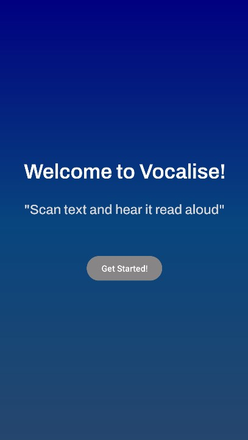

# 🗣️ **Vocalise Beta – ML Kit**

**Vocalise** is a simple Android app that lets you capture text using your camera and have it read aloud instantly. Created using **Google's ML Kit - Text Recognition v2** and Android's **Text-to-Speech** engine. The app is designed to help with accessibility, reading, and **(future)** translation.

---

## 🚀 **Features**

-  Capture an image using the device camera
-  Extract text using the **ML Kit Text Recognition**
-  Read aloud recognised text with the **Text-to-Speech** engine
-  Uses **Hilt** for dependency injection
-  Transitions to a display screen showing the recognised text & image
-  Custom loading dialogs for user experience

---

## 🖼️ **Screenshots**

<table>
  <tr>
    <td align="center"><b>Home</b></td>
    <td align="center"><b>Camera Feed</b></td>
    <td align="center"><b>Text Output</b></td>
  </tr>
  <tr>
    <td></td>
    <td></td>
    <td></td>
  </tr>
</table>

---

## 🛠️ **Tech Stack**

- **Kotlin** & Jetpack libraries
- **ML Kit Text Recognition v2 API**
- **TextToSpeech (TTS)**
- **Hilt** for dependency injection

---

## 📅 **Future Features**

- Improve text recognition accuracy and reduce OCR errors (like mixing up "I" and "1")
- Support for multiple languages
- Real-time text recognition from live camera feed
- Customisable Text-to-Speech voice and speed settings
  
---

## 📦 **Installation**

1. Clone the repository:
```bash
git clone https://github.com/AntoOfo/Vocalise-Beta-MLKit
cd Vocalise-Beta-MLKit
```
2. Open the project in Android Studio.

3. Let Gradle sync and download all dependencies.

5. Run the app on an emulator or physical Android device.
